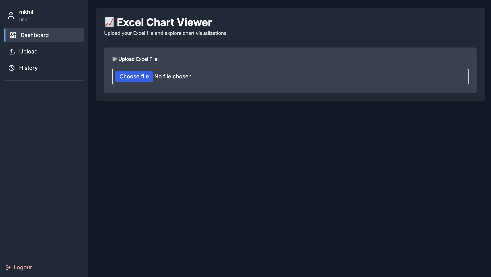
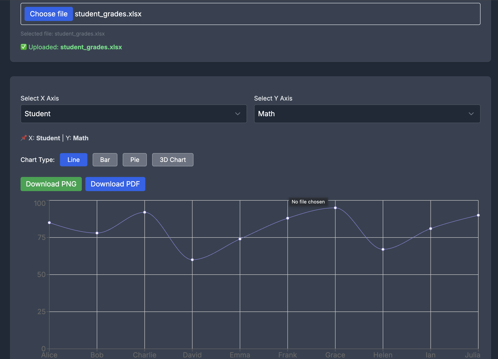
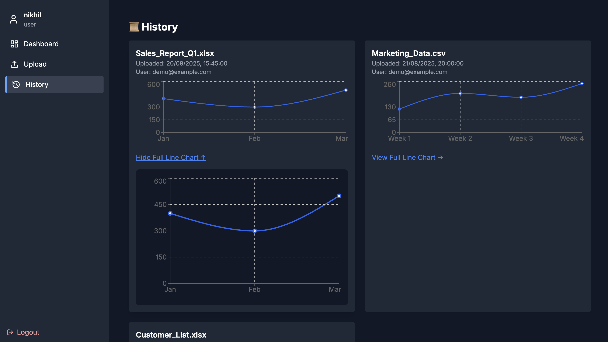
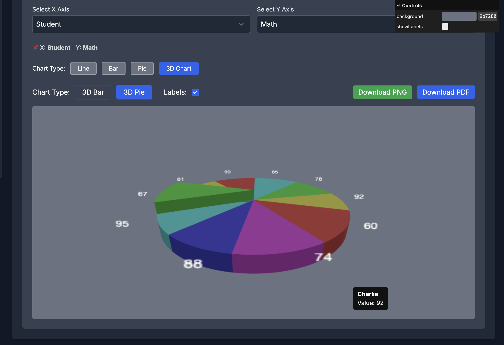

# 📊 Excel Analytics Platform (MERN)

This project is a **MERN-based Excel Analytics Platform** that allows users to upload Excel files, parse the data, and generate interactive 2D/3D charts. It’s designed for **students, educators, and analysts** who want a simple yet powerful way to visualize data directly from spreadsheets. Each user can track their upload history, while admins manage overall usage. The platform is ideal for learning, classroom projects, or as a portfolio-ready full-stack application.


## 🚀 Features

- 🔐 **User Authentication**  
  - Register, Login, Forgot Password, Reset Password  

- 📂 **Excel File Upload**  
  - Supports `.xlsx` format  

- 📊 **Data Visualization**  
  - Line Charts  
  - Bar Charts  
  - Pie Charts  
  - 3D Charts  

- 🕒 **History Tracking**  
  - View previously uploaded files  

- 👨‍💻 **Admin Panel**  
  - Manage all uploads  
  - Delete files  
  - Control users  

- 📱 **Responsive UI**  
  - Built with React.js + Tailwind CSS  

## 🏗️ Tech Stack

### 🎨 Frontend
- ⚛️ **React.js** – Component-based UI
- 🎨 **Tailwind CSS** – Modern styling framework
- 📊 **Recharts** – Interactive 2D Charts
- 📈 **Three.js / react-three-fiber** – 3D Data Visualization
- 🔄 **Redux Toolkit** – State Management

### 🚀 Backend
- 🟢 **Node.js + Express** – REST API
- 🗄️ **MongoDB + Mongoose** – Database & ODM
- 🔑 **JWT Authentication** – Secure Login & Role-based Access
- 📂 **Multer** – File Upload Handling

### 🛠️ Tools & Utilities
- 🖥️ **Visual Studio Code** – Code Editor  
- 🌐 **Postman** – API Testing  
- 🐙 **Git & GitHub** – Version Control  
- 📦 **npm** – Package Manager  
- ⚡ **Concurrently** – Run backend & frontend together  
- ☁️ **MongoDB Atlas** – Cloud Database Hosting

### 📁 Folder Structure

```
Backend/
├── config/
├── controllers/
│   ├── authController.js       # Handles user authentication logic
│   ├── excelController.js      # Handles Excel data processing
│   └── uploadController.js     # Handles file upload functionality
├── middleware/
│   └── authMiddleware.js       # Middleware for authentication
├── models/
│   ├── ExcelData.js            # Excel data schema/model
│   ├── Upload.js               # Upload metadata model
│   └── User.js                 # User model
├── routes/
│   ├── authRoutes.js           # Auth-related API routes
│   ├── excelRoutes.js          # Excel-related API routes
│   └── uploadRoutes.js         # Upload-related API routes
├── uploads/                    # Uploaded Excel files
└── server.js                   # Main backend entry point

Frontend/
├── public/
│   └── images/                 # Screenshots for README or UI assets
├── src/
│   ├── components/             # Reusable React components
│   │   ├── AxisSelector.jsx
│   │   ├── ChartViewer.jsx
│   │   ├── FileUploader.jsx
│   │   └── ThreeDChartViewer.jsx
│   ├── layout/
│   │   └── SidebarLayout.jsx
│   ├── pages/                  # Main pages for routing
│   │   ├── Dashboard.jsx
│   │   ├── Upload.jsx
│   │   ├── History.jsx
│   │   ├── Login.jsx / Register.jsx
│   │   └── ForgotPassword.jsx / ResetPassword.jsx
│   ├── redux/                  # Redux slices for state management
│   │   ├── authSlice.js
│   │   └── chartSlice.js
│   ├── utils/                  # Helper functions and services
│   │   ├── api.js
│   │   ├── parseExcel.js
│   │   └── historyUtils.js
│   ├── App.jsx                 # Root React component
│   └── index.js               # Entry point for React
```

1. **Register/Login**
   - Create an account or log in with your credentials.

2. **Upload Excel File**
   - Go to the Upload page and upload any `.xlsx` or `.xls` file.
   - Example: `student_grades.xlsx`

3. **Visualize Data**
   - Select X and Y axes from the Excel columns.
   - Choose chart type: Bar, Line, Pie, Scatter, or 3D Chart.
   - Instantly view interactive charts.

4. **Download Charts**
   - Export graphs as PNG or PDF for reports/presentations.

5. **History**
   - View your past uploads and analyses in the Dashboard.

6. **Admin Panel (for admins only)**
   - Manage users, delete uploads, and oversee platform activity.


## Screenshots






## Roadmap

- 📱 Improve mobile responsiveness for better usage on smaller devices  
- 🌍 Additional browser support (Safari, Edge, Firefox, etc.)  
- 📊 Add more chart types (Radar, Heatmap, Stacked Charts)  
- 🔗 Add integrations with Google Sheets & CSV imports  
- 💾 Enable cloud storage support (AWS S3, Google Drive, Dropbox)  
- 👥 Role-based dashboards (Teachers, Students, Admins)  
- 🧠 AI-powered insights (automatic trend detection & predictions)  
- 📤 One-click export to PDF/Excel with charts  
## 🚀 Deployment

The **Excel Analytics Platform** is live! You can access the deployed versions of the project below:

- 🌐 **Frontend (React App on Netlify):** [https://excel-analytics-frontend.netlify.app](https://excel-analytics-frontend.netlify.app)
- 🛠️ **Backend (API on Render):** [https://excel-analytics-backend-daoj.onrender.com](https://excel-analytics-backend-daoj.onrender.com)

📌 **Note:**  
- Replace the above URLs with your actual deployment links after deploying.  
- Make sure your backend URL is accessible and CORS-enabled so the frontend can communicate with it.  
- If you have demo credentials for testing, you can also mention them here (e.g., `admin@test.com / password`).

## 🗓️ Development Timeline

| Week | Tasks                                                                 |
|------|----------------------------------------------------------------------|
| **Week 1** | ⚙️ Project setup, implement User/Admin authentication, design dashboard layout |
| **Week 2** | 📂 File upload setup, Excel parsing logic, store structured data in MongoDB |
| **Week 3** | 📊 Chart rendering with **Chart.js** & **Three.js**, allow users to select axes dynamically |
| **Week 4** | 🕒 Save analysis history, enable downloadable reports, integrate AI API for summaries (optional) |
| **Week 5** | 🛠️ Admin panel, testing & bug fixes, deployment (**Render** for backend, **Netlify** for frontend) |## 🎨 Color Reference

## 🎨 Color Reference

| Color Name      | Preview                                                                 | Hex       |
|------------------|------------------------------------------------------------------------|-----------|
| Dark Background |  | #0d1117   |
| Sidebar Gray    |  | #1f2937   |
| Accent Blue     |  | #2563eb   |
| Success Green   |  | #22c55e   |
| Text White      |  | #f8fafc   |
| Login Gradient  |  →  | #a855f7 → #3b82f6 |

## 🔑 Authentication

- POST /api/auth/register
- POST /api/auth/login

Excel (Protected)
- POST   /api/excel/upload            → upload & parse Excel
- GET    /api/excel/history           → current user's uploads
- GET    /api/excel/:id               → one upload
- POST   /api/excel/:id/analysis      → save analysis meta
- DELETE /api/excel/:id               → delete own upload

Admin (Protected + Admin)
- GET    /api/excel/admin/alluploads  → list all uploads
- DELETE /api/excel/admin/:id         → delete any upload

## 🙌 Acknowledgements  

A huge thanks to the amazing tools and libraries that made this project possible 🚀  

- 📊 [SheetJS (xlsx)](https://sheetjs.com/) — Excel file parsing & data extraction  
- 📈 [Chart.js](https://www.chartjs.org/) / [Recharts](https://recharts.org/en-US/) — Interactive 2D chart visualizations  
- 🌀 [Three.js](https://threejs.org/) — Stunning 3D chart rendering  
- 🛠️ [Redux Toolkit](https://redux-toolkit.js.org/) — Simplified state management  
- ☁️ [MongoDB Atlas](https://www.mongodb.com/atlas/database) — Scalable cloud database  

---

✨ *Made with ❤️ using the MERN Stack (MongoDB, Express, React, Node.js)*  
